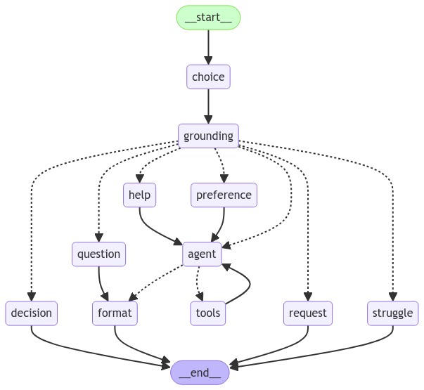
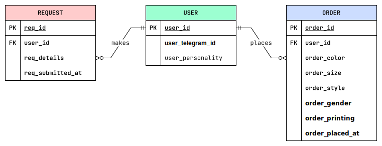

# AnadeaBot

A minimalistic T-shirt design bot. The bot is available as a Telegram bot at [@tee_customizer_bot](https://t.me/tee_customizer_bot).

###### Abilities

The bot has the following abilities:

- guide a user through the T-shirt design process and make orders

- answer questions from users based on a FAQ

- detect struggles of a user and send requests to support if needed

###### Stack

The stack the app is built with is:

- LangGraph as a framework

- LangChain for RAG and model interactions

- Pyrogram as an interface and API of an application

- PostgreSQL as a primary database and a vectorstore

###### Overview

A flow of processing of user messages is illustrated on a diagram below. The image was automatically generated using LangGraph. Rectangles stand for nodes, dashed arrows for conditional edges, and solid arrows for unconditional edges. The processing starts from the `choice` node, that tries to detect and extract design choices, such as color, in a user message. Then, in the `grouning` node, based on the conversation a set of the most relevant ground truth facts composed from FAQ are retrieved and put in the context of the conversation. Next, the system determines the most probable user intent and routes a message to a corresponding branch. If a user specified a choice of T-shirt attribute, the `preference` node fires, if a user asked a question the  `question` node fires, and so on. The `agent` node in the middle handles the main design flow. Other nodes perform corresponding to their name function.

The entity-relationship diagram below illustrates the structure of the database. Other tables for vector stores and chat history are managed by LangChain and LangGraph respectively.. When a user first starts a conversation with the bot, a new record is created in the `USER` table. All orders and requests are stored in corresponding tables and linked to a user. When a user deletes a bot, all its data is deleted as well, including conversation history.

 
