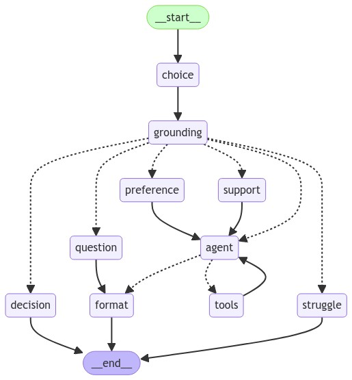

# AnadeaBot

An LLM-based minimalistic T-shirt design bot.

#### Capabilities

The bot has the following capabilities:

- guide a user through the T-shirt design process and make orders;

- answer questions of a user based on FAQ;

- detect struggles of a user and send support requests if needed.

#### Stack

The stack the application is built with is:

- `LangGraph` as a framework;

- `LangChain` for RAG and model interactions;

- `Pyrogram` as an interface and API of the application;

- `PostgreSQL` as a primary database and a vector store.

#### Overview

A flow of processing of user messages is illustrated on a diagram below. The image was automatically generated using LangGraph. Rectangles stand for nodes, dashed arrows for conditional edges, and solid arrows for unconditional edges. The processing starts from the `choice` node, that tries to detect and extract design choices, such as color, in a user message. Then, in the `grouning` node, based on the conversation a set of the most relevant ground truth facts composed from FAQ are retrieved and put in the context of the conversation. Next, the system determines the most probable user intent and routes a message to a corresponding branch. If a user specified a choice of T-shirt attribute, the `preference` node fires, if a user asked a question the  `question` node fires, and so on. The `agent` node in the middle handles the main design flow. Other nodes perform corresponding to their name function.

The `question` node performs RAG to answer questions of users. First, it refines a question of a user to make it clear and self-contained, and then uses a retriever to find the most relevant documents of two kinds:  questions with linked answers, and ground truth facts composed from question-answer pairs. These documents are then passed to the LLM along with the question, so the model can come up with the best answer.

The entity-relationship diagram below illustrates the structure of the database. Other tables for vector stores and chat history are managed by LangChain and LangGraph respectively. When a user first starts a conversation with the bot, a new record is created in the `USER` table. All orders and requests are stored in corresponding tables and linked to a user. When a user deletes a bot, all its data is deleted as well, including conversation history.

#### Repository

The main module is `graph`, it contains the application logic. `handlers` module contains Telegram message handlers. `prompts` and `schemas` modules contain LLM prompts and Pydantic schemas for structured output respectively. `tools` module contains T-shirt attribute recommendation tools. `options` is the possible attribute options. `models` contains ORM models and `database` module contains database queries. `middleware` is a wrapper for message handlers to provide automatic request context. `settings` contains application configuration.